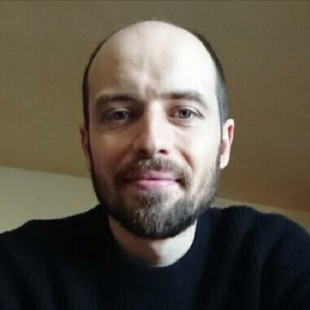
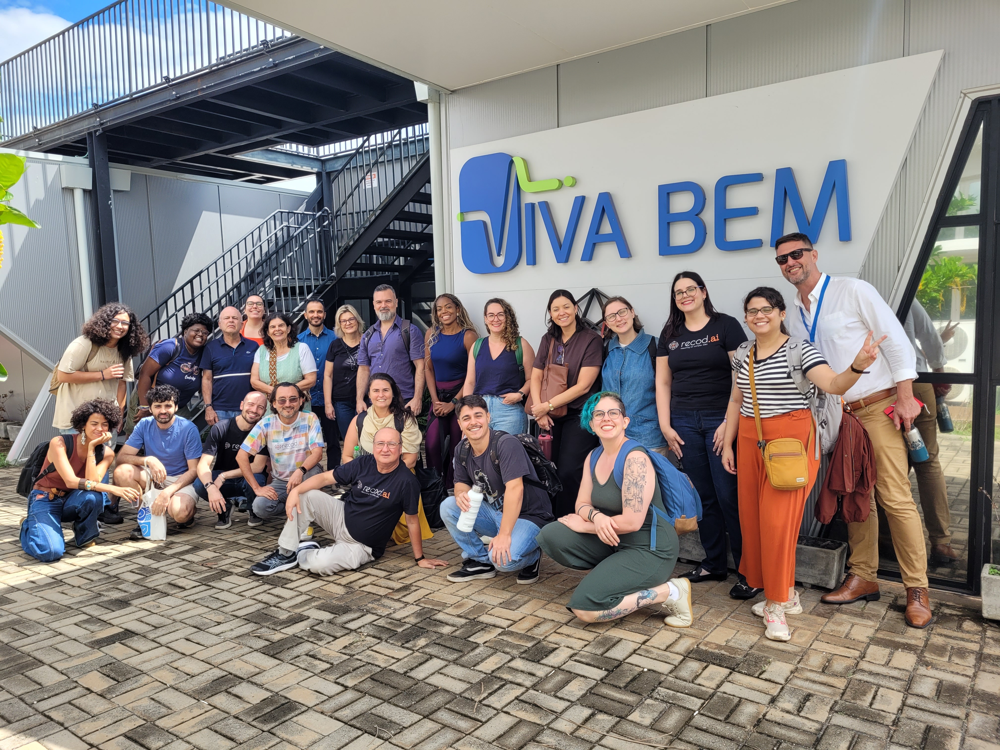

::: {.site-nav}

[About](#about) [Research](#research) [CV](cv.pdf) [Contact](#contact)

:::

::: {#about .about-section}

::: {.about-grid}

::: {.profile-column}

Fabio Carrella

**Postdoctoral Researcher** 
Recod.ai Lab 
Institute of Computing 
University of Campinas (UNICAMP)

<a href="https://scholar.google.com/citations?user=c99Fq90AAAAJ&hl=it" aria-label="Google Scholar" title="Google Scholar">
  <i class="fa fa-university"></i>
</a>

<a href="https://orcid.org/0000-0003-4918-3875" aria-label="ORCID" title="ORCID">
  <i class="fa-brands fa-orcid"></i>
</a>

<a href="https://bsky.app/profile/fabiocarrella.bsky.social" aria-label="Bluesky" title="Bluesky">
  <i class="fa-brands fa-bluesky"></i>
</a>

<a href="mailto:carrella@unicamp.br" aria-label="Email" title="Email">
  <i class="fa-solid fa-envelope"></i>
</a>

<a href="cv.pdf" aria-label="CV" title="CV">
  <i class="fa-regular fa-file-lines"></i>
</a>

:::

::: {.bio-column}

I am a researcher working at the intersection of language, communication, and computational social science. I am currently a Postdoctoral Researcher at the Institute of Computing, University of Campinas (UNICAMP), where I study misinformation, political communication, and digital media using computational methods.

My research explores how information, misinformation, and political discourse shape beliefs and behaviour in digital environments. I am particularly interested in how political actors communicate online, how people encounter and respond to unreliable information, and how emerging technologies such as large language models are changing digital communication and the dynamics of misinformation.

In recent years, my work has increasingly moved towards computational approaches to social science, including natural language processing, text analysis, large language models, and computational analysis of digital data. Before joining UNICAMP, I was a Senior Research Associate at the University of Bristol, and I currently serve on the Editorial Board of *Communications Psychology*.

My research has appeared in journals including *Nature Human Behaviour*, *Nature Communications*, *PNAS Nexus*, *Communications Psychology*, and *EACL*.

:::

:::

:::

::: {#research .content-section}

# Research

My research explores how information, misinformation, and political communication shape beliefs and behaviour in digital environments. I draw on perspectives from linguistics, communication, and social science, increasingly combining them with computational approaches to analyse language and digital data at scale.

My work has addressed political discourse and misinformation, honesty and political communication, and digital persuasion and microtargeting. More recently, I have increasingly moved towards research on artificial intelligence, exploring how AI-generated and AI-mediated content interacts with misinformation and communication dynamics in online communities, and how large language models can be used to study communication and social behaviour. Across these areas, I use empirical and computational methods including text analysis, natural language processing, statistical modelling, experiments, and analyses of social media and other digital data.

My current work focuses increasingly on artificial intelligence, misinformation, and digital communities, with particular attention to AI-mediated communication and the use of large language models to study social behaviour.

## Selected Publications

[**Computational analysis of US congressional speeches reveals a shift from evidence to intuition.**](https://doi.org/10.1038/s41562-025-02136-2)  
*Nature Human Behaviour*, 2025.

[**Different honesty conceptions align across US politicians' tweets and public replies.**](https://doi.org/10.1038/s41467-025-56753-6)  
*Nature Communications*, 2025.

[**Social media sharing of low-quality news sources by political elites.**](https://doi.org/10.1093/pnasnexus/pgac186)  
*PNAS Nexus*, 2022.

[**Warning people that they are being microtargeted fails to eliminate persuasive advantage.**](https://doi.org/10.1038/s44271-025-00188-8)  
*Communications Psychology*, 2025.

[**From alternative conceptions of honesty to alternative facts in communications by US politicians.**](https://doi.org/10.1038/s41562-023-01691-w)  
*Nature Human Behaviour*, 2023.

[**IRMA: the 335-million-word Italian coRpus for studying MisinformAtion.**](https://aclanthology.org/2023.eacl-main.171/)  
*EACL*, 2023.

[**GERMA: A comprehensive corpus of untrustworthy German news.**](https://doi.org/10.1515/lingvan-2024-0064)  
*Linguistics Vanguard*, 2025.

:::

::: {#contact .content-section}

# Contact

I am based at the [Recod.ai Lab](https://recod.ai/en/), Institute of Computing, University of Campinas (UNICAMP).

Email: [carrella@unicamp.br](mailto:carrella@unicamp.br)

:::

